# WEB-P8 Product Design audit：真实数据边界与可操作性

- 被审计原型：`v3-product-prototype.html`
- 主任务：在 Codex 左侧对话、右侧 Web 的 768×1080 工作面里，先读出事实，再完成一个安全动作；Map 只用于解释依赖。
- 数据快照：2026-08-30 读取 GitHub Issue #147；页面明确标为 captured snapshot，不冒充 live connection。
- 交互环境：用户当前选择的 Chrome；通过 Chrome DevTools Protocol 发送真实 pointer、keyboard 与 text input 事件，未使用 Playwright。
- 审计证据：`../evidence/webp8/audit-results.json` 与本文件逐屏截图。
- 当前裁决：浏览器与视觉回归已通过；Web artifact 仍为 `NOT_CONFIRMED`，等待用户确认新的数据架构。

## 1. 先回答“这些数据是真的吗”

旧版不是 #147 的真实运行态还原。它把真实的 `#147` 身份与 D17、I42、RepoLane、candidate、Receipt、SHA、等待时间等 coverage fixture 混在同一现场中，会让人误以为 GitHub Issue 提供了这些字段。

修订版只允许五种 provenance 在各自 truth scope 内成立：

| 标签 | 当前页面中的事实 | 权威来源 | 缺失时怎么办 |
| --- | --- | --- | --- |
| `ISSUE` | #147 title、state/reason、author、label、时间、12 个 native sub-issue、closure comment、native relation summary | GitHub Issue API 的 captured snapshot | 显示 unavailable/stale，不用模拟值补洞 |
| `DOSSIER` | 访谈已完成、prototype pending、WEB-P8 rework、artifact 尚未确认 | 本 issue 目录的 manifest/context/rounds | 显示 dossier unavailable |
| `REPO` | RepoLane、Profile、Gate、Receipt、candidate、attempt、actor、quorum、当前动作 | 未来 runtime/repo adapter | 当前一律 `NOT_CONNECTED`；不声称存在记录 |
| `DERIVED` | #148～#151 映射 Discovery、#152～#159 映射 Contract、固定六阶段的位置 | 已记录访谈规则 + Issue 类型标题 | 必须带 `DERIVED`，不能冒充 tracker 原生字段 |
| `SIMULATED` | 跨 RepoLane、requires-decision、degraded registry、stale Receipt、Human Review | 独立 coverage scenario | ID 全部使用 `SIM-*`，持续显示 `SIMULATED GAP` 横幅 |

本次真实 Issue 快照证明：#147 为 `CLOSED / completed`、无 assignee、标签为 `wayfinder:map`、12/12 native sub-issue 已关闭、native `blocked-by / blocking` 均为 0。它没有提供 RepoLane/Profile/Gate/Receipt/current action 等运行字段。完整事实记录见 `../../1-interview/facts/issue-147-real-data.md` 与 `../../1-interview/facts/web-prototype-fixture-provenance.md`。

## 2. 评审标准

本轮不仅检查“截图看起来像页面”，还检查真实旅程是否可完成：

- 信息层级：十秒内能否区分当前事实、证据缺口、下一步与数据新鲜度。
- 数据诚信：缺失事实必须 `NOT_CONNECTED / NOT_RUN / N/A`，不得被 fixture 填成假现场。
- 状态可理解性：状态不能只靠颜色；固定阶段、`N/A` 与 simulated 状态必须有文字。
- 键盘与焦点：Tabs 遵循 [WAI-ARIA Tabs Pattern](https://www.w3.org/WAI/ARIA/apg/patterns/tabs/) 的方向键习惯；Modal 遵循 [Dialog Modal Pattern](https://www.w3.org/WAI/ARIA/apg/patterns/dialog-modal/) 的初始焦点、Escape 与焦点归还。
- 目标大小：所有有效交互目标至少满足 [WCAG 2.2 Target Size (Minimum)](https://www.w3.org/WAI/WCAG22/Understanding/target-size-minimum) 的 24×24 CSS px；核心 CTA 维持 44px。
- 动态反馈：toast 使用 status live region，并避开底部 Inspector；参考 [WCAG Status Messages](https://www.w3.org/WAI/WCAG21/Understanding/status-messages)。
- 响应式：601/720/768/820/900/1440/1920 不产生页面级横向溢出；480 只允许六阶段局部横向滚动。

## 3. 前后视觉对照

### 3.1 从“真假混合”改为真实事实默认页

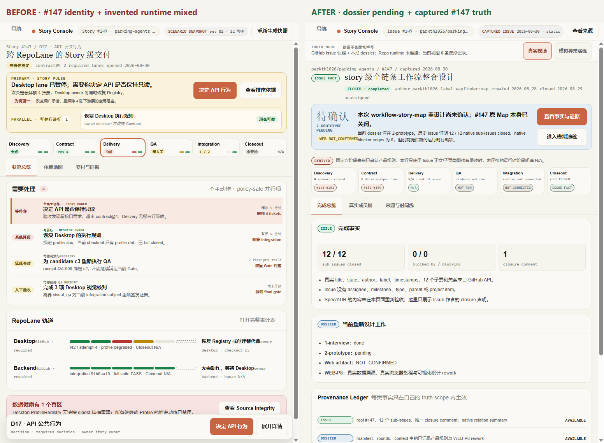

新版默认进入“真实现场”：主结论先说当前 dossier 为 `2-PROTOTYPE PENDING / WEB NOT_CONFIRMED`，再把 `12 / 12 CLOSED` 表达为 #147 历史 Map 的证据；native relation 为 0、runtime `NOT_CONNECTED`，不再从一个虚构阻塞开始，也不把历史关闭误读为本次重设计完成。

### 3.2 把缺失覆盖样本隔离为演练

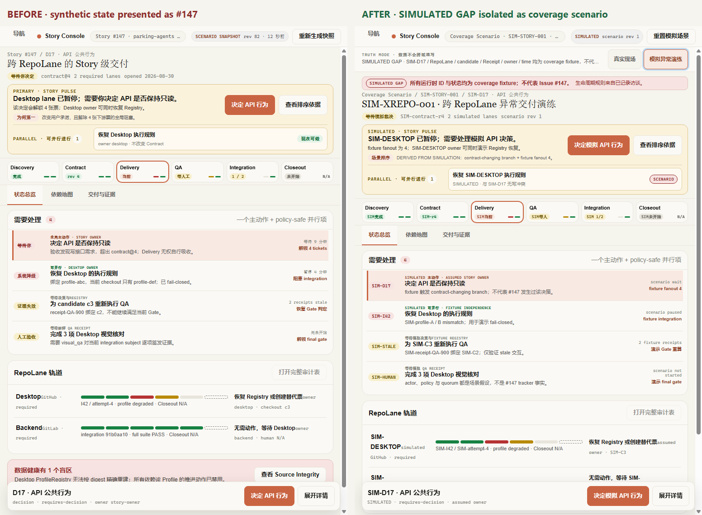

模拟演练仍保留跨 RepoLane、Decision、Registry degraded、stale evidence 与 Human Review，因为它们是检验 UI 能否承载目标产品的重要样本；但其身份、文案、Badge、Receipt 与 evidence 均使用 `SIM-*`，并明确“不代表 Issue #147”。

## 4. 真实浏览器旅程

### 1）打开默认页，先判断当前事实 — 健康

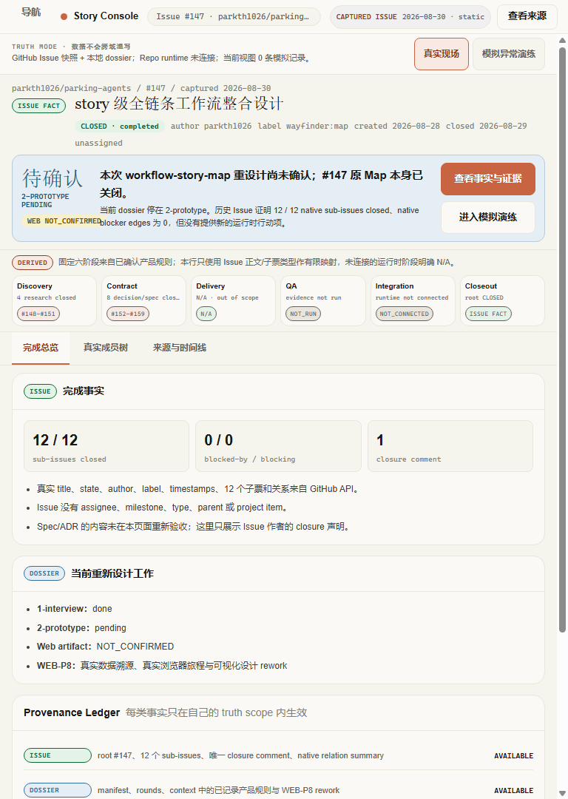

首屏把本次重设计“待确认”放在主 Pulse，并同时给出历史 Issue 完成态、12/12、没有真实运行行动项、固定六阶段和 provenance ledger。它先回答“当前工作到哪了”，再回答“历史 Issue 证明了什么”。

### 2）切换真实成员树 — 健康

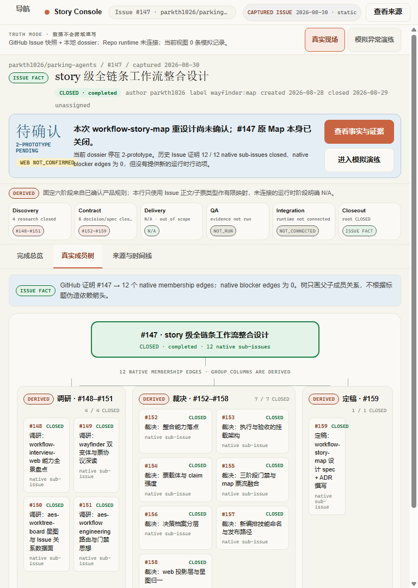

展示 root #147、12 条 native membership 关系与 12 个可访问的真实子票链接；三列栏目明确标为 `DERIVED`。由于 native dependency edge 为 0，页面拒绝根据标题画依赖箭头。

### 3）用右方向键切换到证据与时间线 — 健康

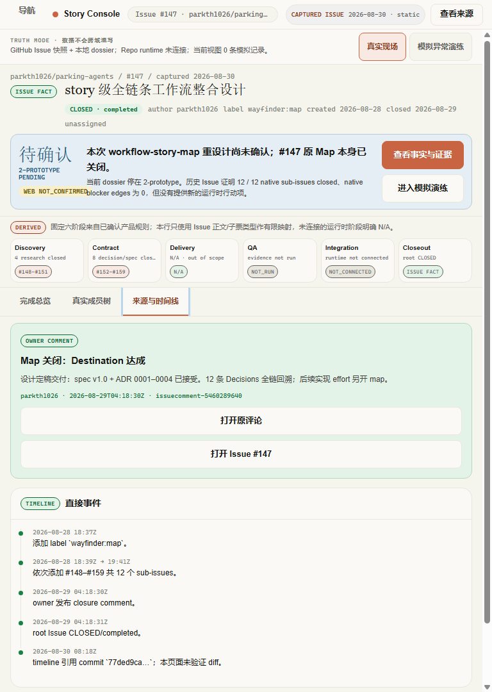

Issue closure comment、close event 与后续 commit reference 分开呈现；Issue 的“作者声明已达成”没有被冒充成当前 repo/runtime 的重新验证。

### 4）查看数据来源 Modal — 健康

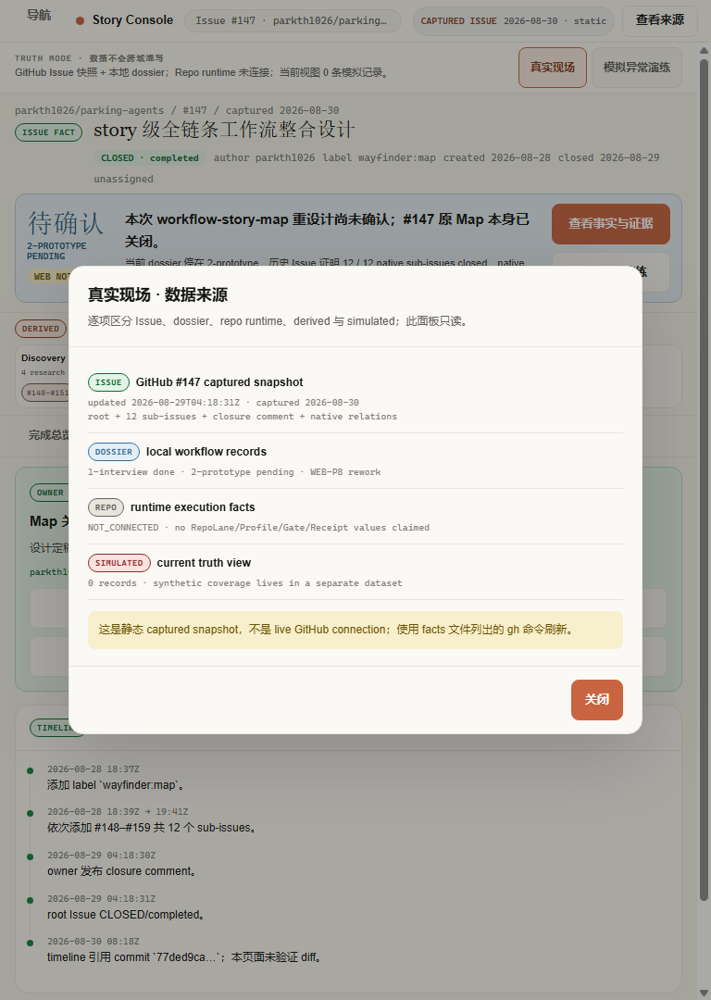

Modal 初始焦点位于标题，Escape 关闭后回到“查看来源”；`ISSUE / DOSSIER / REPO / SIMULATED` 的范围与刷新限制可直接阅读。

### 5）切到模拟异常演练 — 健康

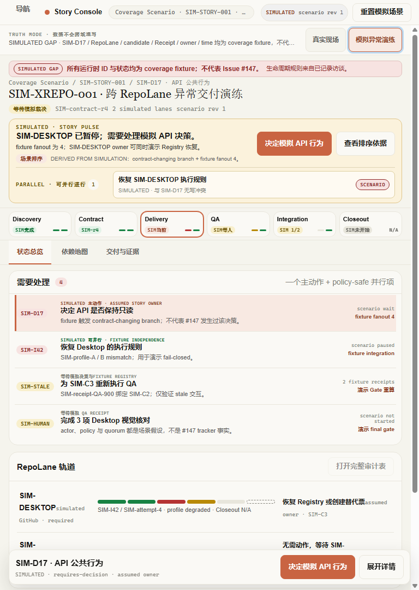

方向键可在“真实现场 / 模拟异常演练”间切换。模拟页持续显示 `SIMULATED GAP`，主体为 `SIM-XREPO-001 / SIM-STORY-001`，旧版所有运行数据已与 #147 脱钩。

### 6）用真实 pointer 打开 Decision — 健康

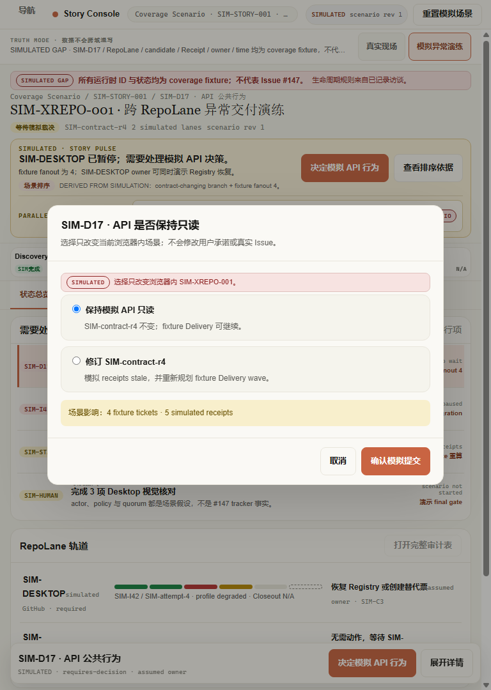

初始焦点落到第一个 radio，而不是直接落到提交按钮；提交 CTA 为 44px，并说明只改变演练内存状态。

### 7）切换 Map 并“回到当前阻塞” — 健康

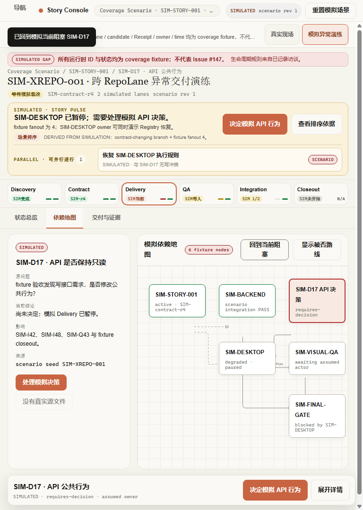

Map 是第二视图；选中对象同步到 Inspector。回归中发现 toast 会压住 64px Inspector peek，现已移动到左上非交互 truth summary 区，不覆盖 mode controls、工作行或 Inspector；Map 两个动作按钮均为 44px。

### 8）检查被前置阻塞的 Human Test — 健康

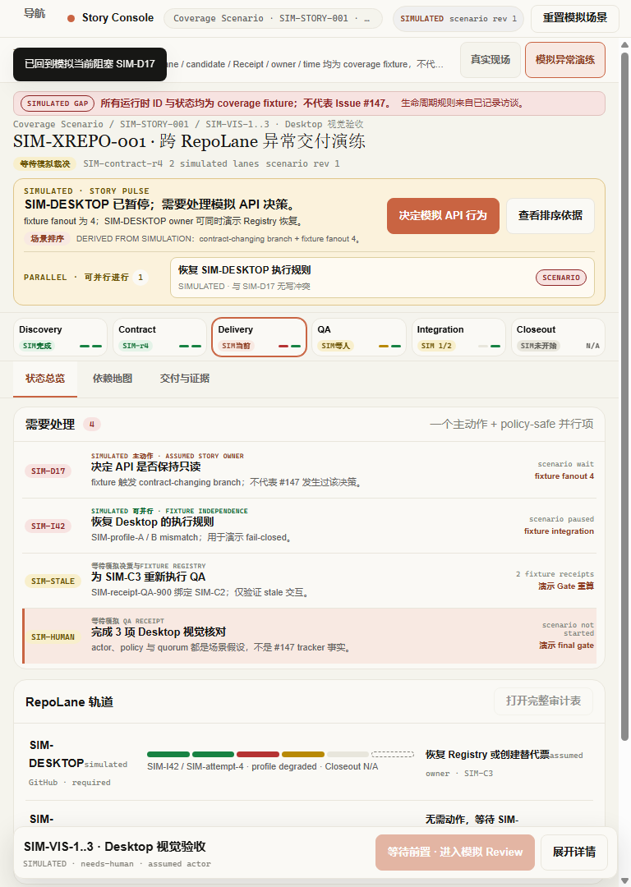

按钮 disabled，旁边同时写明“等待模拟 QA Receipt”；这不是只靠灰色表达的不可用状态。

### 9）走完简单前置动作并进入 Review Workspace — 健康

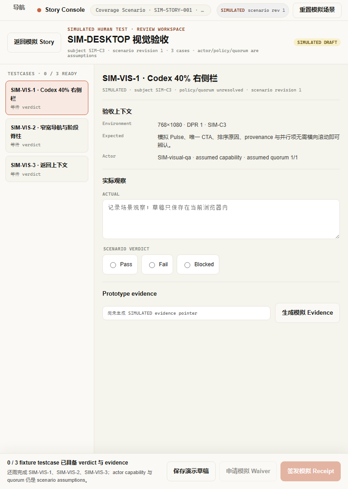

在 768px 宿主下，Workspace 使用 208px testcase rail + 560px work pane，没有退化为窄 Modal；标题获得初始焦点。

### 10）录入 Actual、选择 verdict、生成 evidence、保存草稿 — 健康

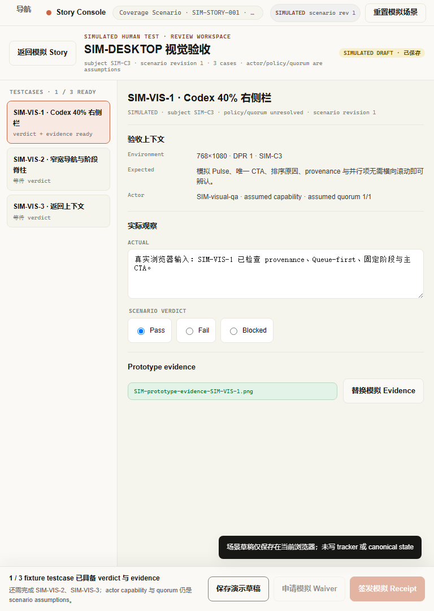

pointer、文字输入、radio、evidence、save 均真实触发；输出保持 `SIMULATED DRAFT` 与 `SIM-prototype-evidence-*`，不会伪造真实 Receipt。

### 11）返回 Story 并恢复上下文 — 健康

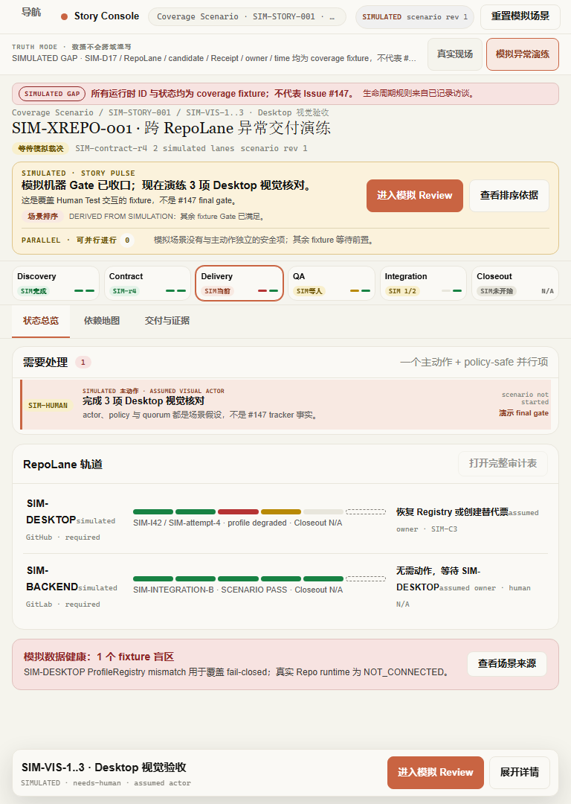

恢复原 view、selection 与触发焦点；旧 toast 已清除，不再覆盖 Inspector。

### 12）480px 真实事实页 — 有界通过

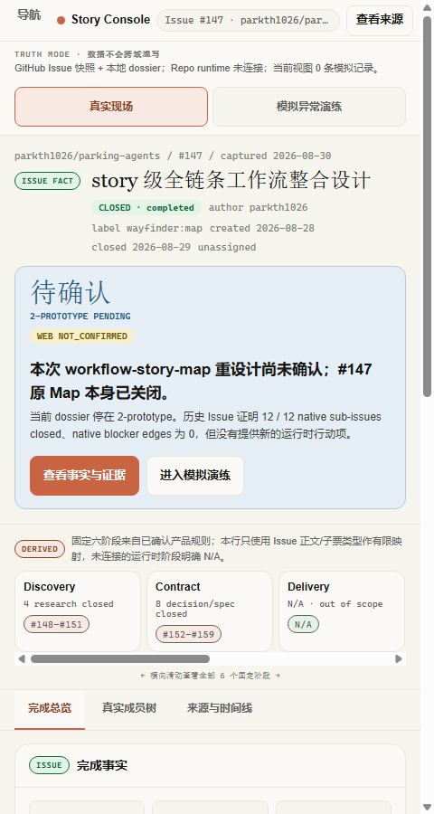

没有页面级横向溢出；六阶段作为一个明确的局部 scroller。480 是补充边界，不替代 768 的一等宿主验收。

### 13）480px 模拟页 — 有界通过

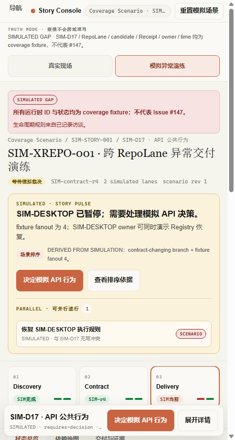

Truth Mode、SIMULATED 横幅、主动作与阶段仍能按纵向阅读；密度没有被 601～900px Queue-first 规则错误继承。

### 14）1440px 真实事实页 — 健康

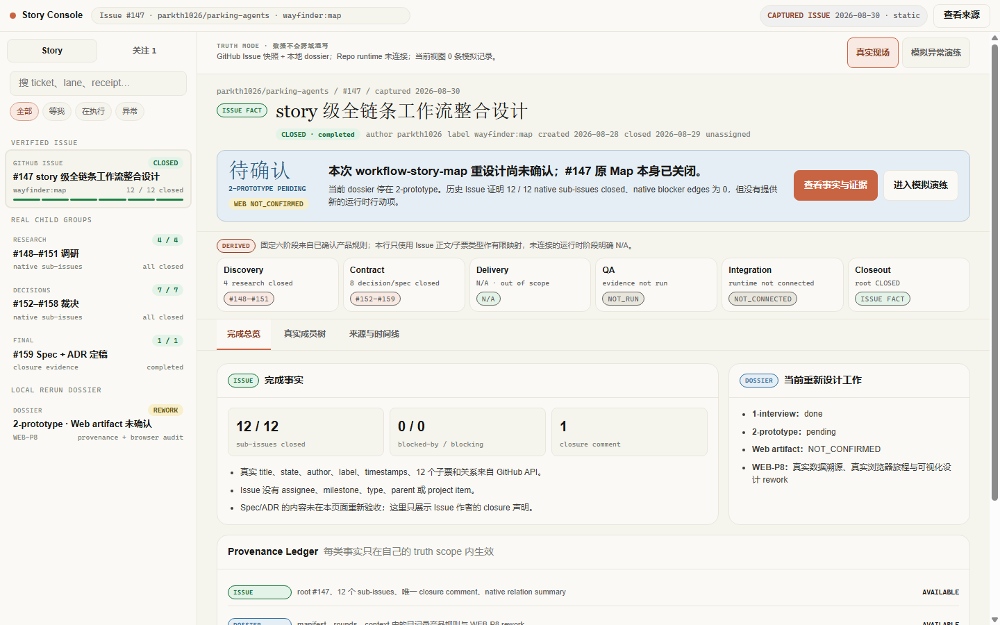

宽屏恢复对象导航、主工作面与 Inspector 三列，信息密度没有被窄栏策略永久压缩。

## 5. 自动与人工检查结果

| 检查 | 结果 | 证据 |
| --- | --- | --- |
| 真实 Issue 默认模式、title/state、12 个 child link、0 native dependency edge | PASS | `audit-results.json.flow.realOverview / realMap` |
| 真实/模拟 mode tabs 与真实 view tabs 的方向键 | PASS | `modeKeyboard / issueTabKeyboard` |
| Modal 初始焦点、Escape、焦点归还、44px footer CTA | PASS | `realSourceModal / decisionModal` |
| Map reset、blocked Human Test、Review 完整编辑与返回 | PASS | `scenarioMap / blockedHuman / reviewStart / reviewEdited / reviewReturn` |
| 601/720/768/820/900/1440/1920 页面级横向溢出 | PASS — body clientWidth = scrollWidth | `responsive` |
| 480 页面级横向溢出 | PASS — 仅 stage strip 局部横滑 | `viewport480Issue / viewport480Scenario` |
| 有效目标低于 24px | PASS — 0 | `targets.below24` |
| 可访问树中的无名 button | PASS — 0 | `accessibilityTree.unnamedButtons` |
| reduced motion | PASS — transition 0s | `reducedMotion` |
| console/runtime error | PASS — 0 | `consoleErrors` |
| 逐屏视觉检查：裁切、遮挡、toast、底部 Inspector、宽度与密度 | PASS | 本文件 14 张实现截图与 2 张同屏对照 |

## 6. 仍然不能声称已经通过的内容

- 真实 screen reader traversal：`NOT_RUN`。
- 200% browser zoom：`NOT_RUN`。
- Windows high-contrast：`NOT_RUN`。
- 320px reflow：`NOT_RUN`；当前最窄实测为 480px。
- 真正的 GitHub/GitLab/repo runtime 聚合：`NOT_CONNECTED`。
- 真 evidence 上传、持久化草稿、tracker/repo mutation：prototype 范围内 `N/A`。
- 多 actor Waiver/quorum 完整路径：尚未制作；是否必须在 Web 确认前完成仍可单独裁决。

## 7. 结论

这次重做解决的是数据真实性与可操作性两个 P0 问题，而不是换一层配色：

1. 默认现场现在只说能被 #147 与本地 dossier 证明的事实。
2. 缺失的运行态不再被“合理猜测”填满，而是明确 `NOT_CONNECTED`。
3. 为覆盖目标产品风险而保留的复杂状态被隔离为可操作的 `SIMULATED GAP`。
4. 真实 Chrome 旅程覆盖了读取、Tab、Modal、Map、blocked action、Review 编辑、返回恢复和多宽度布局。

因此，这个版本已经达到“可让用户质疑真实数据边界与主要交互”的 prototype 标准；但用户尚未确认该数据架构，所以不能把 Web artifact 或 `2-prototype` 标记为 done。
