# WEB-P9 v4 Product audit：Story 全局双地图优先

- Prototype：`v4-map-first-prototype.html`
- 领域依据：`v4-map-first-rationale.md`、`../../1-interview/facts/web-v4-dual-map-domain-audit.md`
- 主视口：768×1080；补充：480×900、1440×1000。
- 交互：Chrome DevTools Protocol 原生 pointer、keyboard 与 text input；未使用 DOM `.click()` 作为验收输入。
- 机器证据：`../evidence/webp9-v4/audit-results.json`
- 当前状态：实现与内部 QA 通过；Web artifact 仍为 `NOT_CONFIRMED`。

## 1. 用户质疑的直接回答

顶部六格不是最初领域模型，它是 v3 为固定空间记忆新增的 UI 选择。这个选择现在已经被 WEB-P9 推翻。

正确分类是：

| 名称 | 正确类别 | v4 表达 |
| --- | --- | --- |
| DiscoveryMap | 动态需求/探索子图 | 上半画布；实际 research、decision、prototype ticket |
| Contract | 版本化承诺边界和 subject | 中间 revision seam；不是阶段格 |
| DeliveryMap | 动态实现/交付子图 | 下半画布；实际 wave、RepoLane 与 WorkTicket |
| QA / Review / Human Test | Profile/Gate/evidence topology | 有独立工作时才成为节点，否则挂在来源票 |
| Integration | 每条 RepoLane 的 terminal subject/Gate | DeliveryMap lane 末端 Gate |
| Closeout | StoryRoot terminal reducer | Story acceptance reducer；没有固定 Closeout 槽位 |

## 2. v3 → v4 的结构变化

### 真实 #147

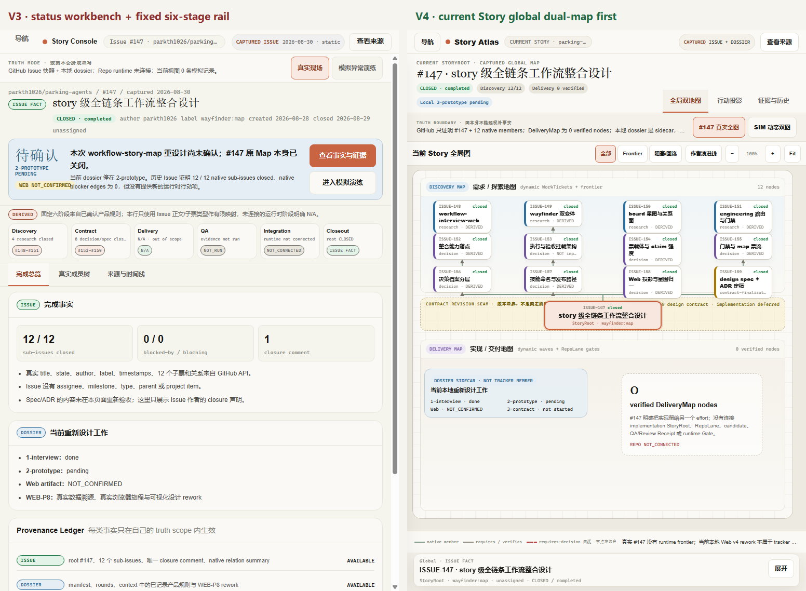

v4 默认首屏同时展示 StoryRoot、真实 DiscoveryMap、Contract seam 和真实空 DeliveryMap。#153 明确保持 decision，#159 保持 design contract；页面不再把它们映射成 implementation 或固定阶段完成度。

### SIM active Story

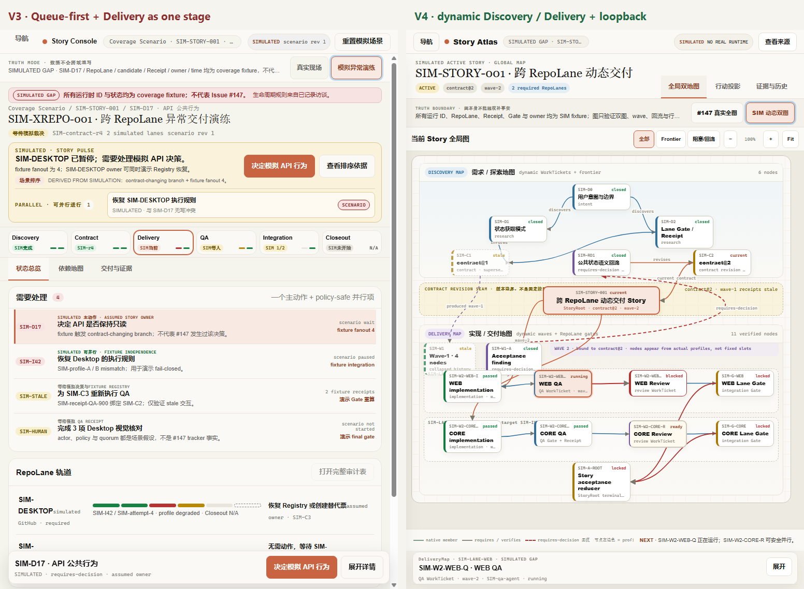

模拟模式不再用六阶段概括复杂交付。它直接画出 contract@1、wave-1 finding、requires-decision 回流、contract@2、wave-2 两条 RepoLane 和最终 Story reducer。

## 3. 真实浏览器旅程

### 3.1 默认就是当前 Story 全局图 — PASS

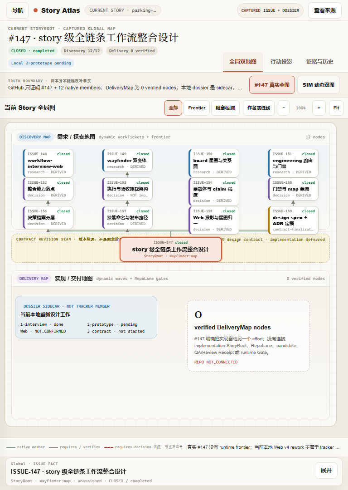

- 全局图 tab 默认选中；固定阶段元素数量为 0。
- DiscoveryMap 有 12 个真实 child nodes。
- DeliveryMap 明确为 `0 verified nodes / REPO NOT_CONNECTED`。
- 本地 dossier 是独立 sidecar，不是第 13 张 tracker ticket。
- 768×1080 内 canvas、legend、frontier summary 与 Inspector peek 同屏。

### 3.2 选中 #153，验证它不是实现节点 — PASS

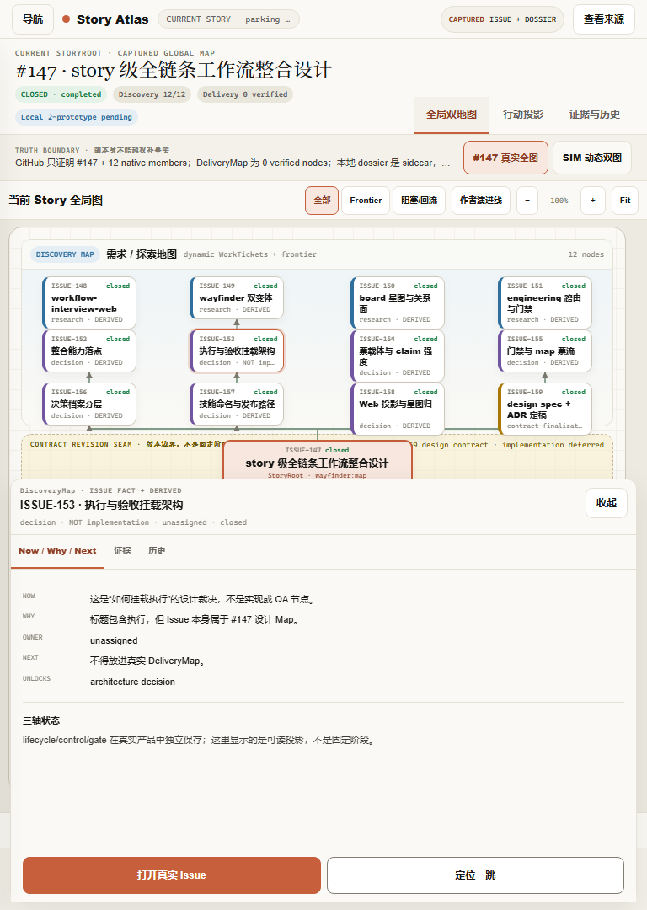

Inspector 明确显示 `decision · NOT implementation`，并解释“执行与验收挂载架构”只是设计裁决，不得放进真实 DeliveryMap。

### 3.3 作者演进叙事与 native dependency 分离 — PASS

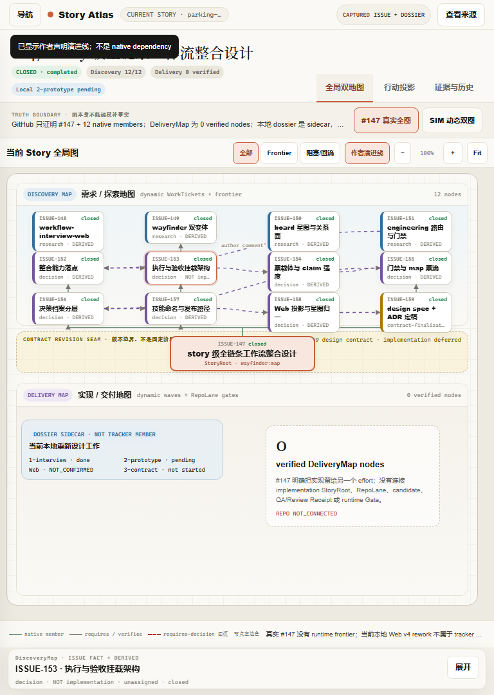

“作者演进线”默认关闭；打开后用紫色虚线显示，并持续说明它来自 closure comment、不是 native dependency。真实 native blocker edge 仍为 0。

### 3.4 Source modal — PASS

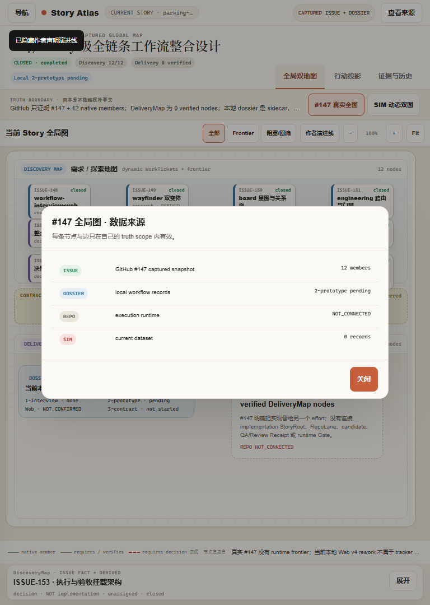

初始焦点位于标题，Escape 返回“查看来源”；Issue、Dossier、Repo 与 Simulated 的边界可直接读取。

### 3.5 SIM 动态双图 — PASS

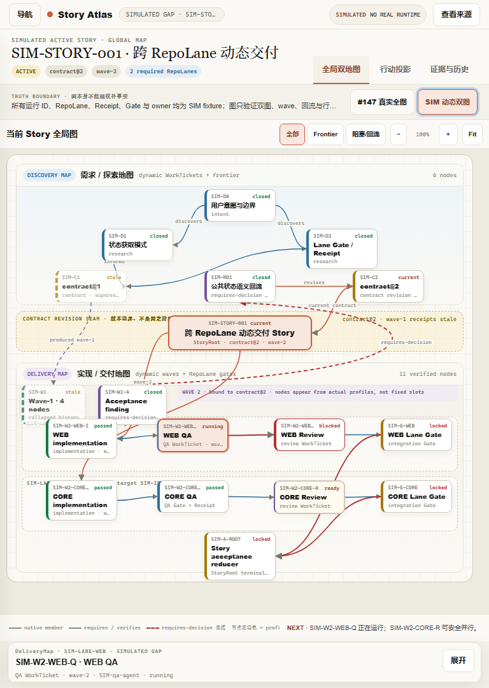

可见语义：

- 6 个 DiscoveryMap nodes；
- 11 个 DeliveryMap nodes；
- contract@1 → requires-decision → contract@2；
- wave-1 stale history 与 wave-2 current work；
- WEB / CORE 两条 required RepoLane；
- `SIM-W2-WEB-Q` 为 NEXT，`SIM-W2-CORE-R` 为安全并行；
- 1 条 Delivery→Discovery 红色虚线回流边；
- 两条 Lane Gate 未满足，Story acceptance reducer locked。

### 3.6 Frontier lens — PASS

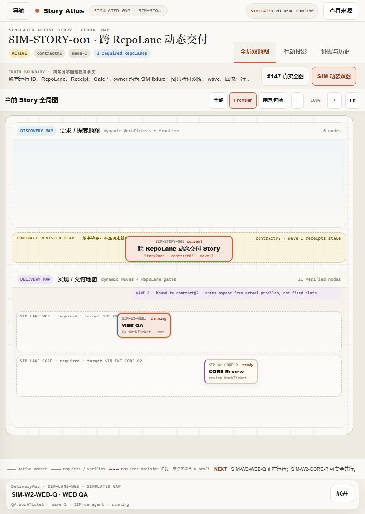

过滤后只保留 StoryRoot 与两个 frontier 节点，不产生另一套状态；恢复“全部”后原图与位置不变。

### 3.7 节点 → Inspector → Review Workspace → 返回 — PASS

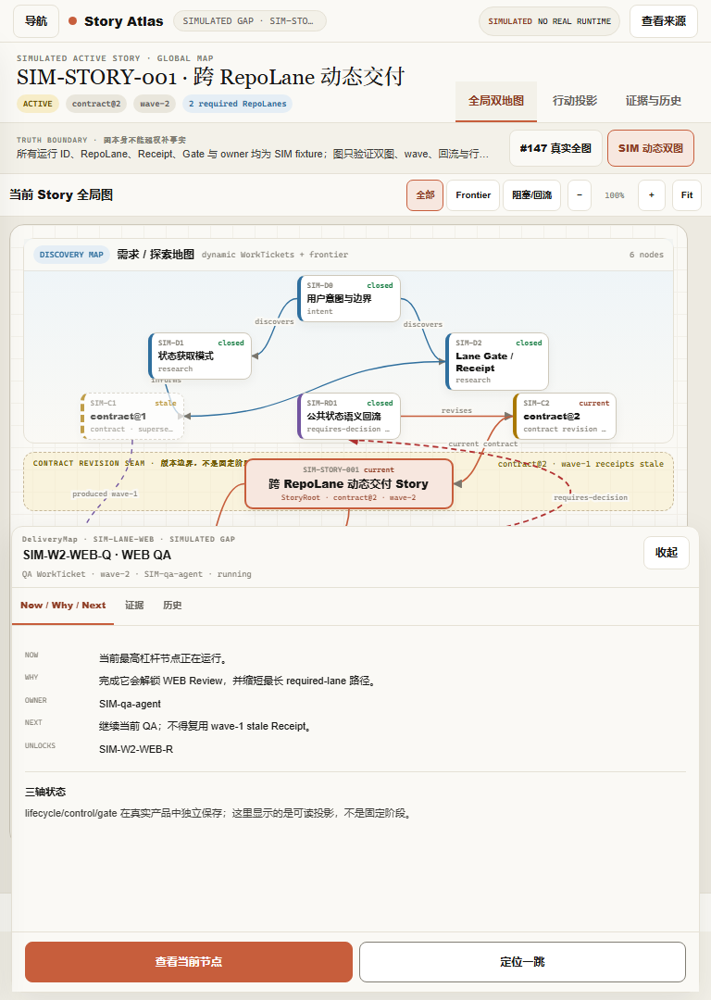

选中节点后同一个底部 sheet 回答 Now / Why / Owner / Next / Unlocks；简单模拟动作留在 Modal。

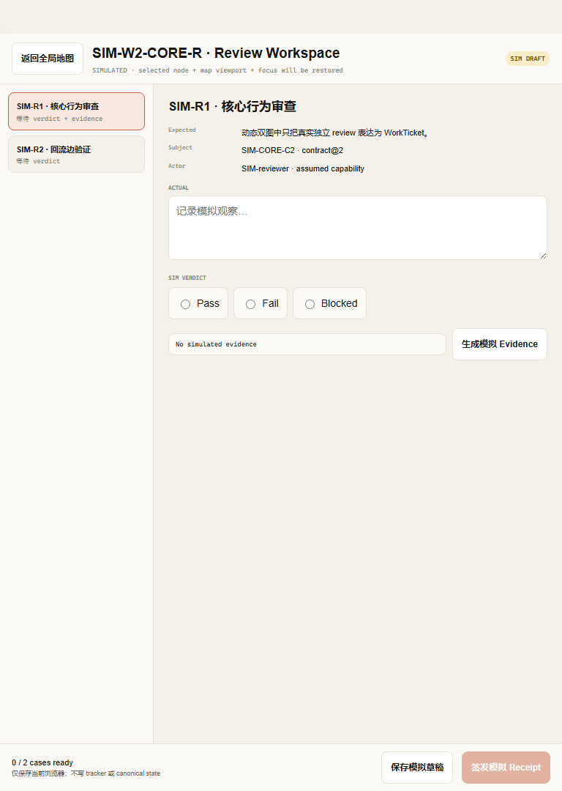

CORE Review 使用专用 Workspace。真实 pointer/text/radio/evidence/save 均已执行；返回后恢复 dataset、global-map tab、map viewport、`SIM-W2-CORE-R` selection、Inspector open state 与 focus。

### 3.8 Action / Evidence 是地图派生第二层 — PASS

- 行动投影只列两个当前 frontier，并能分别指回 `SIM-W2-WEB-Q` 与 `SIM-W2-CORE-R`。
- Evidence 页保留两个 wave-1 stale Receipt，均为 `GATE NONE`；fresh contract@2 Receipt 单独呈现。

### 3.9 响应式 — PASS

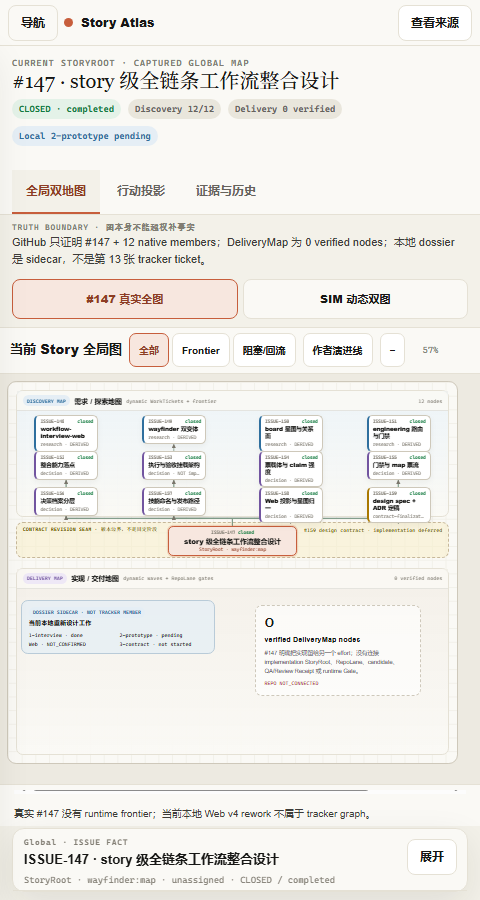

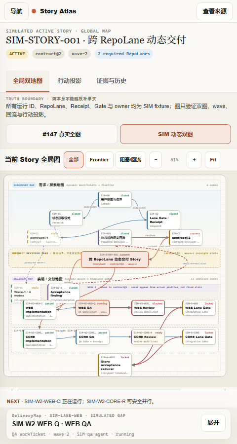

480px 默认自动 `Fit Story` 到 57–61%，完整 StoryRoot、双图和 seam 同屏；用户可用 zoom 放大后局部平移。页面本身无横向溢出。

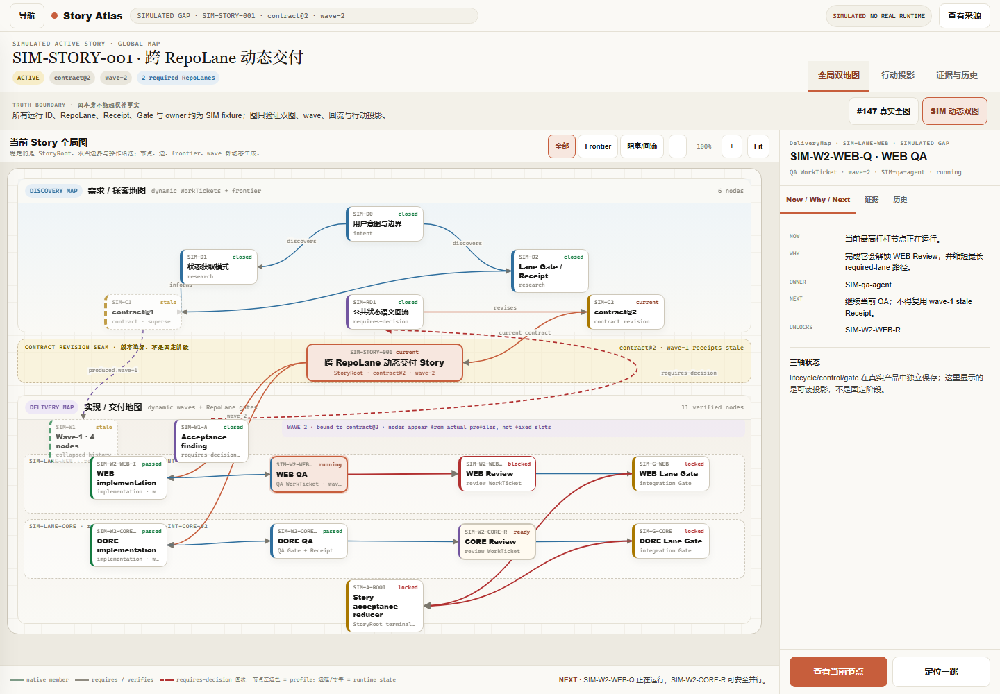

1440px 使用常驻右侧 Inspector，地图仍保持上下双图，不改变空间模型。

## 4. 自动断言

| 检查 | 结果 |
| --- | --- |
| 默认 view=`map`、dataset=`current` | PASS |
| 固定阶段 DOM 元素 | PASS — 0 |
| 真实 Discovery / Delivery | PASS — 12 / 0 verified |
| SIM Discovery / Delivery | PASS — 6 / 11 |
| SIM requires-decision 回流边 | PASS — 1 |
| SIM frontier | PASS — WEB QA + CORE Review |
| Review 输入、verdict、evidence、draft、返回恢复 | PASS |
| 768 body 横向溢出 | PASS — 768/768 |
| 480 body 横向溢出 | PASS — 480/480 |
| 1440 body 横向溢出 | PASS — 1440/1440 |
| 有效 target 小于 24px | PASS — 0 |
| accessibility tree unnamed buttons | PASS — 0 |
| reduced motion | PASS — transition 0s |
| console/runtime errors | PASS — 0 |

## 5. 视觉迭代记录

第一版浏览器检查发现：

1. wave-1 history 节点与 wave-2/lane 标识争夺同一区域；
2. 768px Story reducer 太贴近画布底部；
3. dataset 切换会残留上一模式的 toast；
4. 480px 以 100% 打开只能看到局部，不能满足“全局地图第一印象”。

修正后：

- wave-1 history 移到 DeliveryMap 左上独立区域，wave-2 带只占右侧；
- lane territory 下移，Story reducer 上移；
- dataset 切换清理 toast 与旧 Inspector；
- ≤600px 的 Fit 同时计算宽和高，真实图为 57%，SIM 图为 61%，整张图完整进入镜头。

同视口复核未发现残留 P0/P1/P2。

## 6. 仍未执行

- 真实 screen reader traversal：`NOT_RUN`。
- 200% browser zoom：`NOT_RUN`。
- Windows high contrast：`NOT_RUN`。
- 320px viewport：`NOT_RUN`。
- 真实同构 active Story runtime：`NOT_CONNECTED`。
- 多 actor Waiver/quorum：尚未在 v4 中展开。

## 7. 结论

v4 已经纠正“固定流程感”的根因：地图容器稳定，Ticket 与关系动态；Contract 是 seam，QA/Integration 是实际节点或 Gate，StoryRoot reducer 持有最终终态。

浏览器与视觉 QA 结论：`PASS_WITH_DECLARED_GAPS`。

产品确认结论：`NOT_CONFIRMED`。
