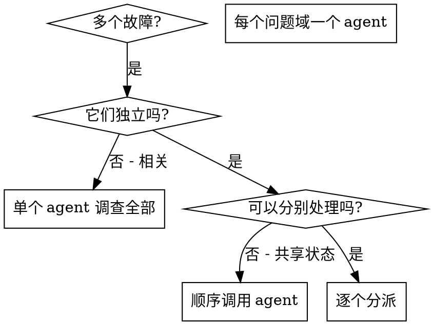

# 分派并行 Agent

## 概述

将任务委派给具有隔离上下文的专门 agent。通过精确构建其指令和上下文，确保它们保持专注并成功完成任务。它们不应继承你的会话上下文或历史——你构建它们所需的一切。这也保留了你自己的上下文用于协调工作。

当有多个不相关的故障（不同的测试文件、不同的子系统、不同的 bug）时，逐个调查浪费时间。每个调查是独立的，可以分别进行。

**核心原则：** 每个独立问题域分派一个 agent。逐个调用 runSubagent，每个任务独立。

## 何时使用



**使用场景：**
- 3+ 个测试文件因不同根因失败
- 多个子系统独立损坏
- 每个问题无需其他问题的上下文即可理解
- 调查之间无共享状态

**不要使用：**
- 故障相关（修复一个可能修复其他）
- 需要理解完整系统状态
- Agent 之间会互相干扰

## 模式

### 1. 识别独立域

按故障点分组：
- 文件 A 测试：工具审批流程
- 文件 B 测试：批量完成行为
- 文件 C 测试：中止功能

每个域独立——修复工具审批不影响中止测试。

### 2. 创建专注的 Agent 任务

每个 agent 获得：
- **明确范围：** 一个测试文件或子系统
- **清晰目标：** 使这些测试通过
- **约束条件：** 不要修改其他代码
- **预期输出：** 发现和修复的摘要

### 3. 逐个分派

```
// VS Code Copilot 中通过 runSubagent 逐个调用
// 每个任务独立，互不依赖

runSubagent("修复 agent-tool-abort.test.ts 失败")
runSubagent("修复 batch-completion-behavior.test.ts 失败")
runSubagent("修复 tool-approval-race-conditions.test.ts 失败")
```

**注意：** VS Code Copilot 中 runSubagent 是顺序调用的，不支持真正的并行。每个 subagent 完成后再调用下一个。

### 4. 审查与集成

当 agent 返回时：
- 阅读每份摘要
- 验证修复不冲突
- 运行完整测试套件
- 集成所有变更

## Agent Prompt 结构

好的 agent prompt 应该：
1. **专注** ——一个清晰的问题域
2. **自包含** ——理解问题所需的所有上下文
3. **明确输出** ——agent 应该返回什么？

```markdown
修复 src/agents/agent-tool-abort.test.ts 中的 3 个失败测试：

1. "should abort tool with partial output capture" - 期望消息中包含 'interrupted at'
2. "should handle mixed completed and aborted tools" - fast tool 被中止而非完成
3. "should properly track pendingToolCount" - 期望 3 个结果但得到 0

这些是时序/竞态条件问题。你的任务：

1. 阅读测试文件，理解每个测试验证什么
2. 找出根因——时序问题还是实际 bug？
3. 修复方式：
   - 用基于事件的等待替换任意超时
   - 如发现中止实现中的 bug 则修复
   - 如测试的行为已变更则调整测试期望

不要只是增加超时——找到真正的问题。

返回：你发现了什么以及你修复了什么的摘要。
```

## 常见错误

**❌ 范围太宽：** "修复所有测试" ——agent 会迷失
**✅ 具体：** "修复 agent-tool-abort.test.ts" ——聚焦范围

**❌ 无上下文：** "修复竞态条件" ——agent 不知道在哪里
**✅ 有上下文：** 粘贴错误消息和测试名称

**❌ 无约束：** Agent 可能重构所有东西
**✅ 有约束：** "不要修改生产代码" 或 "只修复测试"

**❌ 模糊输出：** "修好它" ——你不知道什么变了
**✅ 明确输出：** "返回根因和变更的摘要"

## 何时不使用

**相关故障：** 修复一个可能修复其他——先一起调查
**需要完整上下文：** 理解需要看到整个系统
**探索性调试：** 你还不知道什么坏了
**共享状态：** Agent 会互相干扰（编辑相同文件、使用相同资源）

## 真实示例

**场景：** 大规模重构后 3 个文件中有 6 个测试失败

**失败：**
- agent-tool-abort.test.ts：3 个失败（时序问题）
- batch-completion-behavior.test.ts：2 个失败（工具未执行）
- tool-approval-race-conditions.test.ts：1 个失败（执行计数 = 0）

**决策：** 独立域——中止逻辑与批量完成与竞态条件互不相关

**分派：**
```
Agent 1 → 修复 agent-tool-abort.test.ts
Agent 2 → 修复 batch-completion-behavior.test.ts
Agent 3 → 修复 tool-approval-race-conditions.test.ts
```
