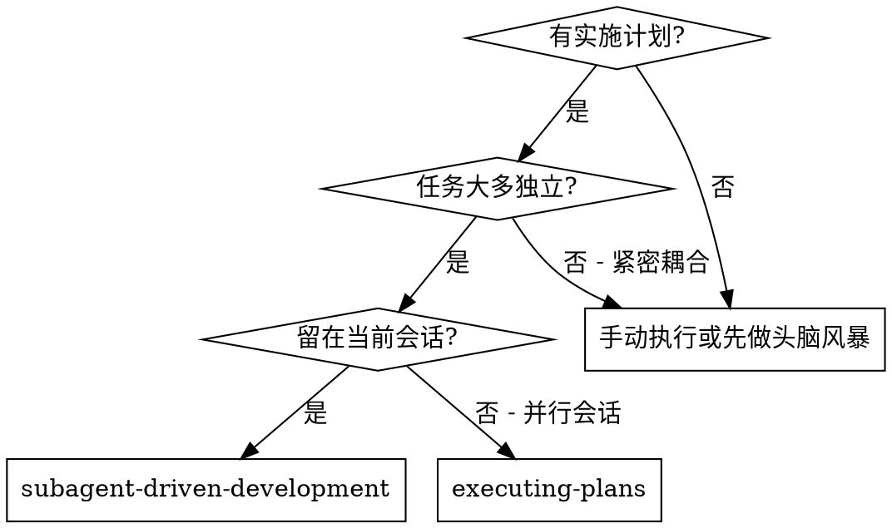
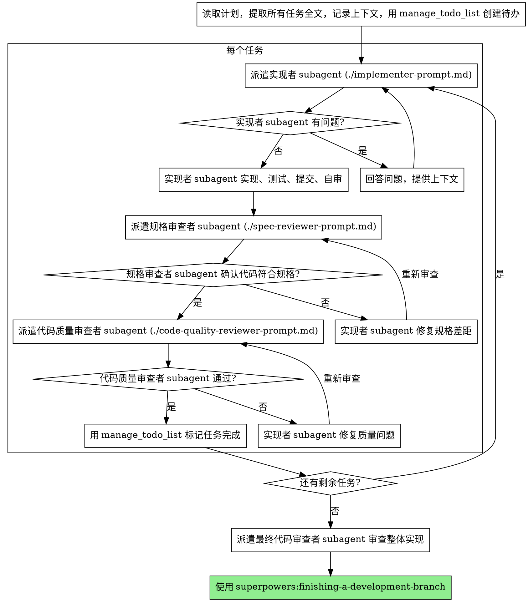

# Subagent 驱动开发

通过为每个任务派遣独立 subagent 来执行计划，每个任务完成后进行两阶段审查：先规格合规审查，再代码质量审查。

**为什么用 subagent：** 你将任务委派给拥有隔离上下文的专门 agent。通过精确构建它们的指令和上下文，确保它们专注并成功完成任务。它们不应继承你的会话上下文或历史——你为它们构建恰好需要的内容。这也能保留你自己的上下文用于协调工作。

**核心原则：** 每个任务一个新 subagent + 两阶段审查（规格 + 质量）= 高质量、快速迭代

**持续执行：** 不要在任务之间暂停与用户确认。从计划中连续执行所有任务不停顿。唯一停止的理由是：无法解决的 BLOCKED 状态、真正阻碍进展的歧义、或所有任务完成。“要继续吗？”式的提问和进度摘要是浪费用户时间——他们要求你执行计划，那就执行。

## 何时使用



**与 Executing Plans（并行会话）的区别：**
- 同一会话（无上下文切换）
- 每个任务一个新 subagent（无上下文污染）
- 每个任务后两阶段审查：先规格合规，再代码质量
- 更快迭代（任务间无人工介入）

## 流程



## 模型选择

为每个角色使用能胜任的最轻量模型，以节省成本并提高速度。

**机械式实现任务**（独立函数、清晰规格、1-2 个文件）：使用快速、低成本模型。当计划充分明确时，大多数实现任务都是机械式的。

**集成和判断任务**（多文件协调、模式匹配、调试）：使用标准模型。

**架构、设计和审查任务**：使用最强可用模型。

**任务复杂度信号：**
- 涉及 1-2 个文件且规格完整 → 低成本模型
- 涉及多个文件且有集成关注 → 标准模型
- 需要设计判断或广泛的代码库理解 → 最强模型

## 处理实现者状态

实现者 subagent 报告四种状态之一。根据情况处理：

**DONE：** 继续规格合规审查。

**DONE_WITH_CONCERNS：** 实现者完成了工作但标记了疑虑。继续前先读取关注点。如果关注点是关于正确性或范围的，在审查前解决。如果是观察性的（如“这个文件越来越大”），记录并继续审查。

**NEEDS_CONTEXT：** 实现者需要未提供的信息。提供缺失的上下文并重新派遣。

**BLOCKED：** 实现者无法完成任务。评估阻塞原因：
1. 如果是上下文问题，提供更多上下文并重新派遣
2. 如果任务需要更强的推理能力，用更强模型重新派遣
3. 如果任务太大，拆分为更小的任务
4. 如果计划本身有误，向用户升级

**永远不要**忽视升级或强迫同一模型在不做任何改变的情况下重试。如果实现者说它被卡住了，就需要改变什么。

## Prompt 模板

通过 `runSubagent` 派遣 subagent，将以下模板中的 prompt 内容作为参数传入：

- `./implementer-prompt.md` - 实现者 subagent prompt
- `./spec-reviewer-prompt.md` - 规格合规审查者 subagent prompt
- `./code-quality-reviewer-prompt.md` - 代码质量审查者 subagent prompt

## 工作流示例

```
你: 我正在使用 Subagent 驱动开发来执行这个计划。

[读取计划文件: docs/superpowers/plans/feature-plan.md]
[提取全部 5 个任务的完整文本和上下文]
[用 manage_todo_list 创建所有任务的待办列表]

任务 1: Hook 安装脚本

[获取任务 1 的文本和上下文（已提取）]
[通过 runSubagent 派遣实现者 subagent，传入完整任务文本 + 上下文]

实现者: "在开始之前——hook 应该安装在用户级还是系统级？"

你: "用户级 (~/.config/superpowers/hooks/)"

实现者: "明白了。开始实现..."
[稍后] 实现者:
  - 实现了 install-hook 命令
  - 添加了测试，5/5 通过
  - 自审: 发现遗漏了 --force 标志，已添加
  - 已提交

[通过 runSubagent 派遣规格合规审查者]
规格审查者: ✅ 规格合规 - 满足所有需求，无多余内容

[获取 git SHA，通过 runSubagent 派遣代码质量审查者]
代码审查者: 优点: 测试覆盖好，代码整洁。问题: 无。通过。

[用 manage_todo_list 标记任务 1 完成]

任务 2: 恢复模式

[获取任务 2 的文本和上下文（已提取）]
[通过 runSubagent 派遣实现者 subagent，传入完整任务文本 + 上下文]

实现者: [无问题，直接开始]
实现者:
  - 添加了验证/修复模式
  - 8/8 测试通过
  - 自审: 一切正常
  - 已提交

[通过 runSubagent 派遣规格合规审查者]
规格审查者: ❌ 问题:
  - 缺失: 进度报告（规格要求"每 100 项报告一次"）
  - 多余: 添加了 --json 标志（未要求）

[实现者修复问题]
实现者: 移除了 --json 标志，添加了进度报告

[规格审查者重新审查]
规格审查者: ✅ 现在规格合规

[通过 runSubagent 派遣代码质量审查者]
代码审查者: 优点: 扎实。问题（重要）: 魔法数字 (100)

[实现者修复]
实现者: 提取了 PROGRESS_INTERVAL 常量

[代码审查者重新审查]
代码审查者: ✅ 通过

[用 manage_todo_list 标记任务 2 完成]

...

[所有任务完成后]
[通过 runSubagent 派遣最终代码审查者]
最终审查者: 所有需求已满足，可以合并

Done!
```

## Advantages

**vs. Manual execution:**
- Subagents follow TDD naturally
- Fresh context per task (no confusion)
- Parallel-safe (subagents don't interfere)
- Subagent can ask questions (before AND during work)

**vs. Executing Plans:**
- Same session (no handoff)
- Continuous progress (no waiting)
- Review checkpoints automatic

**Efficiency gains:**
- No file reading overhead (controller provides full text)
- Controller curates exactly what context is needed
- Subagent gets complete information upfront
- Questions surfaced before work begins (not after)

**Quality gates:**
- Self-review catches issues before handoff
- Two-stage review: spec compliance, then code quality
- Review loops ensure fixes actually work
- Spec compliance prevents over/under-building
- Code quality ensures implementation is well-built

**Cost:**
- More subagent invocations (implementer + 2 reviewers per task)
- Controller does more prep work (extracting all tasks upfront)
- Review loops add iterations
- But catches issues early (cheaper than debugging later)

## Red Flags

**Never:**
- Start implementation on main/master branch without explicit user consent
- Skip reviews (spec compliance OR code quality)
- Proceed with unfixed issues
- Dispatch multiple implementation subagents in parallel (conflicts)
- Make subagent read plan file (provide full text instead)
- Skip scene-setting context (subagent needs to understand where task fits)
- Ignore subagent questions (answer before letting them proceed)
- Accept "close enough" on spec compliance (spec reviewer found issues = not done)
- Skip review loops (reviewer found issues = implementer fixes = review again)
- Let implementer self-review replace actual review (both are needed)
- **Start code quality review before spec compliance is ✅** (wrong order)
- Move to next task while either review has open issues

**If subagent asks questions:**
- Answer clearly and completely
- Provide additional context if needed
- Don't rush them into implementation

**If reviewer finds issues:**
- Implementer (same subagent) fixes them
- Reviewer reviews again
- Repeat until approved
- Don't skip the re-review

**If subagent fails task:**
- Dispatch fix subagent with specific instructions
- Don't try to fix manually (context pollution)

## Integration

**Required workflow skills:**
- **superpowers:using-git-worktrees** - Ensures isolated workspace (creates one or verifies existing)
- **superpowers:writing-plans** - Creates the plan this skill executes
- **superpowers:requesting-code-review** - Code review template for reviewer subagents
- **superpowers:finishing-a-development-branch** - Complete development after all tasks

**Subagents should use:**
- **superpowers:test-driven-development** - Subagents follow TDD for each task

**Alternative workflow:**
- **superpowers:executing-plans** - Use for parallel session instead of same-session execution
