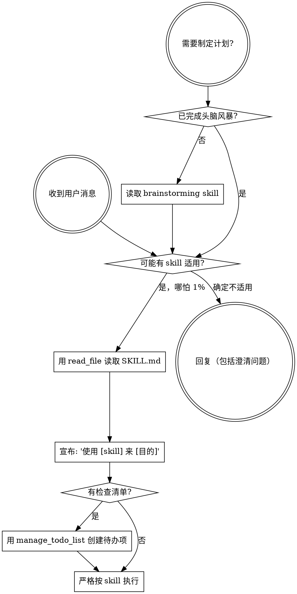

<SUBAGENT-STOP>
如果你是作为 subagent 被派遣执行特定任务的，跳过此 skill。
</SUBAGENT-STOP>

<EXTREMELY-IMPORTANT>
如果你认为哪怕有 1% 的可能某个 skill 适用于你正在做的事，你**必须**调用该 skill。

如果 SKILL 适用于你的任务，你别无选择。必须使用它。

这不可协商。这不是可选项。你不能合理化地绕过它。
</EXTREMELY-IMPORTANT>

## 指令优先级

Superpowers skills 覆盖默认系统提示行为，但**用户指令始终优先**：

1. **用户的明确指令**（copilot-instructions.md、AGENTS.md、直接请求）— 最高优先级
2. **Superpowers skills** — 在冲突处覆盖默认系统行为
3. **默认系统提示** — 最低优先级

如果用户指令说“不要使用 TDD”而某个 skill 说“始终使用 TDD”，遵循用户指令。用户掌控一切。

## 如何访问 Skills

使用 `read_file` 工具读取对应 skill 的 `SKILL.md` 文件。skill 文件位于 `.copilot/skills/<skill-name>/SKILL.md`。读取后，按照其中的指引执行。

# 使用 Skills

## 规则

**在任何回应或行动之前，先读取相关的 skill。** 即使只有 1% 的可能性某个 skill 适用，也应该读取它来检查。如果读取后发现不适用，可以不使用它。

## 危险信号

以下想法意味着“停下”——你在合理化逃避：

| 想法 | 现实 |
|------|------|
| “这只是个简单问题” | 问题也是任务。检查 skills。 |
| “我需要先了解更多上下文” | Skill 检查在澄清问题**之前**。 |
| “让我先探索代码库” | Skills 告诉你**怎么**探索。先检查。 |
| “我可以快速看看 git/文件” | 文件缺少对话上下文。检查 skills。 |
| “让我先收集信息” | Skills 告诉你**怎么**收集信息。 |
| “这不需要正式的 skill” | 如果 skill 存在，就使用它。 |
| “我记得这个 skill” | Skills 会更新。读取当前版本。 |
| “这不算任务” | 行动 = 任务。检查 skills。 |
| “这个 skill 太重了” | 简单的事会变复杂。使用它。 |
| “我先做完这一件事” | 做任何事**之前**先检查。 |
| “这感觉很有效率” | 无纪律的行动浪费时间。Skills 防止这一点。 |
| “我知道那是什么意思” | 知道概念 ≠ 使用 skill。读取它。 |

## Skill 优先级

当多个 skills 可能适用时，使用此顺序：

1. **先用流程类 skills**（brainstorming、debugging）— 它们决定**如何**处理任务
2. **再用实现类 skills**（frontend-design、mcp-builder）— 它们指导执行

“我们来做 X” → 先 brainstorming，再用实现类 skills。
“修复这个 bug” → 先 debugging，再用领域特定 skills。

## Skill 类型

**严格型**（TDD、debugging）：严格遵循。不要减弱纪律。

**灵活型**（patterns）：根据上下文调整原则。

Skill 本身会告诉你它属于哪种。

## 用户指令

指令说的是**做什么**，不是**怎么做**。“添加 X” 或 “修复 Y” 不代表跳过工作流程。
