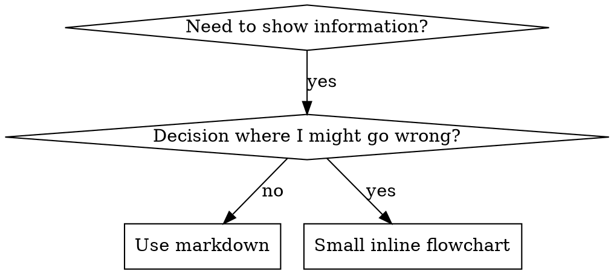

# 编写 Skill

## 概述

**编写 skill 就是将测试驱动开发 (TDD) 应用于流程文档。**

**Skill 存放在项目的 `.copilot/skills/` 目录中。**

你编写测试用例（使用 subagent 的压力场景），观察它们失败（基线行为），编写 skill（文档），观察测试通过（agent 遵守），然后重构（堵住漏洞）。

**核心原则：** 如果你没有观察到 agent 在没有 skill 时失败，你就不知道 skill 是否教了正确的东西。

**必需背景：** 你必须先理解 test-driven-development skill（读取 `.copilot/skills/test-driven-development/SKILL.md`）才能使用本 skill。该 skill 定义了基本的 RED-GREEN-REFACTOR 循环。本 skill 将 TDD 应用于文档。

**官方指南：** 关于 Anthropic 官方 skill 编写最佳实践，请参阅 anthropic-best-practices.md。该文档提供了补充本 skill TDD 方法的额外模式和指南。

## 什么是 Skill？

**Skill** 是经验证的技术、模式或工具的参考指南。Skill 帮助未来的 agent 实例找到并应用有效的方法。

**Skill 是：** 可复用的技术、模式、工具、参考指南

**Skill 不是：** 关于你某次如何解决问题的叙事

## TDD 映射

| TDD 概念 | Skill 创建 |
|-----------|------------|
| **测试用例** | 使用 subagent 的压力场景 |
| **生产代码** | Skill 文档 (SKILL.md) |
| **测试失败 (RED)** | Agent 在没有 skill 时违反规则（基线） |
| **测试通过 (GREEN)** | Agent 在有 skill 时遵守 |
| **重构** | 堵住漏洞同时维持遵守 |
| **先写测试** | 在写 skill 之前运行基线场景 |
| **观察失败** | 记录 agent 使用的确切合理化借口 |
| **最小代码** | 针对那些特定违规编写 skill |
| **观察通过** | 验证 agent 现在遵守 |
| **重构循环** | 发现新合理化借口 → 堵住 → 重新验证 |

整个 skill 创建过程遵循 RED-GREEN-REFACTOR。

## 何时创建 Skill

**创建条件：**
- 技术对你来说不是直觉上显而易见的
- 你会在多个项目中重复引用
- 模式具有广泛适用性（非项目特定）
- 其他人会受益

**不要创建：**
- 一次性解决方案
- 其他地方有良好文档的标准做法
- 项目特定的约定（放入用户指令文件如 copilot-instructions.md）
- 机械约束（如果可以用正则/验证强制执行，就自动化——将文档留给需要判断力的场景）

## Skill 类型

### 技术型
有步骤可循的具体方法（condition-based-waiting、root-cause-tracing）

### 模式型
思考问题的方式（flatten-with-flags、test-invariants）

### 参考型
API 文档、语法指南、工具文档（office docs）

## 目录结构

```
skills/
  skill-name/
    SKILL.md              # 主参考（必需）
    supporting-file.*     # 仅在需要时
```

**扁平命名空间** ——所有 skill 在一个可搜索的命名空间中

**分离文件用于：**
1. **重型参考**（100+ 行）——API 文档、全面的语法
2. **可复用工具** ——脚本、工具、模板

**保持内联：**
- 原则和概念
- 代码模式（< 50 行）
- 其他所有内容

## SKILL.md 结构

**Frontmatter（YAML）：**
- 两个必填字段：`name` 和 `description`（所有支持的字段见 [agentskills.io/specification](https://agentskills.io/specification)）
- 总计最多 1024 字符
- `name`：仅使用字母、数字和连字符（无括号、特殊字符）
- `description`：第三人称，仅描述何时使用（不描述做什么）
  - 以 "Use when..." 开头，聚焦触发条件
  - 包含具体的症状、场景和上下文
  - **永远不要在描述中总结 skill 的流程或工作流**（原因见 CSO 章节）
  - 尽量保持在 500 字符以内

```markdown
---
name: Skill-Name-With-Hyphens
description: Use when [specific triggering conditions and symptoms]
---

# Skill Name

## Overview
What is this? Core principle in 1-2 sentences.

## When to Use
[Small inline flowchart IF decision non-obvious]

Bullet list with SYMPTOMS and use cases
When NOT to use

## Core Pattern (for techniques/patterns)
Before/after code comparison

## Quick Reference
Table or bullets for scanning common operations

## Implementation
Inline code for simple patterns
Link to file for heavy reference or reusable tools

## Common Mistakes
What goes wrong + fixes

## Real-World Impact (optional)
Concrete results
```


## Claude 搜索优化 (CSO)

**对发现至关重要：** 未来的 agent 需要能找到你的 skill

### 1. 丰富的 Description 字段

**目的：** Agent 读取 description 来决定为给定任务加载哪些 skill。让它回答："我现在应该读这个 skill 吗？"

**格式：** 以 "Use when..." 开头，聚焦触发条件

**关键：Description = 何时使用，而非 Skill 做什么**

description 应该仅描述触发条件。不要在 description 中总结 skill 的流程或工作流。

**为什么重要：** 测试揭示，当 description 总结了 skill 的工作流时，agent 可能会遵循 description 而非阅读完整的 skill 内容。一个说"任务间代码审查"的 description 导致 agent 只做了一次审查，尽管 skill 的流程图清楚地显示了两次审查（规格合规性 + 代码质量）。

当 description 改为仅"Use when executing implementation plans with independent tasks"（无工作流摘要）时，agent 正确地阅读了流程图并遵循了两阶段审查流程。

**陷阱：** 总结工作流的 description 创造了 agent 会走的捷径。Skill 正文变成了 agent 会跳过的文档。

```yaml
# ❌ BAD: 总结工作流 - agent 可能遵循此而非读 skill
description: Use when executing plans - dispatches subagent per task with code review between tasks

# ❌ BAD: 太多流程细节
description: Use for TDD - write test first, watch it fail, write minimal code, refactor

# ✅ GOOD: 仅触发条件，无工作流摘要
description: Use when executing implementation plans with independent tasks in the current session

# ✅ GOOD: 仅触发条件
description: Use when implementing any feature or bugfix, before writing implementation code
```

**内容：**
- 使用具体的触发器、症状和表示此 skill 适用的场景
- 描述*问题*（竞态条件、不一致行为）而非*语言特定症状*（setTimeout、sleep）
- 除非 skill 本身是技术特定的，否则保持触发器技术无关
- 如果 skill 是技术特定的，在触发器中明确说明
- 用第三人称书写（注入系统提示）
- **永远不要总结 skill 的流程或工作流**

```yaml
# ❌ BAD: 太抽象、模糊、不包含何时使用
description: For async testing

# ❌ BAD: 第一人称
description: I can help you with async tests when they're flaky

# ❌ BAD: 提到技术但 skill 不特定于它
description: Use when tests use setTimeout/sleep and are flaky

# ✅ GOOD: 以 "Use when" 开头，描述问题，无工作流
description: Use when tests have race conditions, timing dependencies, or pass/fail inconsistently

# ✅ GOOD: 技术特定 skill 带明确触发器
description: Use when using React Router and handling authentication redirects
```

### 2. 关键词覆盖

使用 agent 会搜索的词：
- 错误消息："Hook timed out"、"ENOTEMPTY"、"race condition"
- 症状："flaky"、"hanging"、"zombie"、"pollution"
- 同义词："timeout/hang/freeze"、"cleanup/teardown/afterEach"
- 工具：实际命令、库名、文件类型

### 3. 描述性命名

**使用主动语态，动词在前：**
- ✅ `creating-skills` 而非 `skill-creation`
- ✅ `condition-based-waiting` 而非 `async-test-helpers`

### 4. Token 效率（关键）

**问题：** 常用 skill 加载到每个对话中。每个 token 都很重要。

**目标字数：**
- getting-started 工作流：每个 <150 词
- 频繁加载的 skill：总计 <200 词
- 其他 skill：<500 词（仍要简洁）

**技巧：**

**将细节移到工具帮助中：**
```bash
# ❌ BAD: 在 SKILL.md 中记录所有标志
search-conversations supports --text, --both, --after DATE, --before DATE, --limit N

# ✅ GOOD: 引用 --help
search-conversations supports multiple modes and filters. Run --help for details.
```

**使用交叉引用：**
```markdown
# ❌ BAD: 重复工作流细节
When searching, dispatch subagent with template...
[20 lines of repeated instructions]

# ✅ GOOD: 引用其他 skill
Always use subagents (50-100x context savings). REQUIRED: Read `.copilot/skills/other-skill-name/SKILL.md` for workflow.
```

**压缩示例：**
```markdown
# ❌ BAD: 冗长示例（42 词）
your human partner: "How did we handle authentication errors in React Router before?"
You: I'll search past conversations for React Router authentication patterns.
[Dispatch subagent with search query: "React Router authentication error handling 401"]

# ✅ GOOD: 最小示例（20 词）
Partner: "How did we handle auth errors in React Router?"
You: Searching...
[Dispatch subagent → synthesis]
```

**消除冗余：**
- 不要重复交叉引用 skill 中的内容
- 不要解释命令本身已明了的内容
- 不要包含同一模式的多个示例

**验证：**
```bash
wc -w skills/path/SKILL.md
# getting-started workflows: aim for <150 each
# Other frequently-loaded: aim for <200 total
```

**按你做什么或核心洞察命名：**
- ✅ `condition-based-waiting` > `async-test-helpers`
- ✅ `using-skills` 而非 `skill-usage`
- ✅ `flatten-with-flags` > `data-structure-refactoring`
- ✅ `root-cause-tracing` > `debugging-techniques`

**动名词 (-ing) 适合流程：**
- `creating-skills`、`testing-skills`、`debugging-with-logs`
- 主动式，描述你正在执行的动作

### 4. 交叉引用其他 Skill

**编写引用其他 skill 的文档时：**

仅使用 skill 名称，带明确需求标记：
- ✅ Good: `**必需子 skill：** 读取 `.copilot/skills/test-driven-development/SKILL.md``
- ✅ Good: `**必需背景：** 你必须理解 systematic-debugging skill（读取 `.copilot/skills/systematic-debugging/SKILL.md`）`
- ❌ Bad: `See skills/testing/test-driven-development`（不清楚是否必需）
- ❌ Bad: `@skills/testing/test-driven-development/SKILL.md`（强制加载，消耗上下文）

**为什么不用 @ 链接：** `@` 语法立即强制加载文件，在你需要之前就消耗 200k+ 上下文。

## 流程图使用



**仅在以下情况使用流程图：**
- 非显而易见的决策点
- 可能过早停止的流程循环
- "何时使用 A vs B"的决策

**永远不要用流程图表示：**
- 参考资料 → 表格、列表
- 代码示例 → Markdown 块
- 线性指令 → 编号列表
- 无语义意义的标签（step1、helper2）

参见 @graphviz-conventions.dot 获取 graphviz 样式规则。

**为用户可视化：** 使用本目录中的 `render-graphs.js` 将 skill 的流程图渲染为 SVG：
```bash
./render-graphs.js ../some-skill           # Each diagram separately
./render-graphs.js ../some-skill --combine # All diagrams in one SVG
```

## 代码示例

**一个优秀的示例胜过多个平庸的**

选择最相关的语言：
- 测试技术 → TypeScript/JavaScript
- 系统调试 → Shell/Python
- 数据处理 → Python

**好的示例：**
- 完整且可运行
- 注释良好，解释为什么
- 来自真实场景
- 清楚地展示模式
- 可直接适配（非通用模板）

**不要：**
- 用 5+ 种语言实现
- 创建填空模板
- 编写人为的示例

你擅长移植——一个优秀的示例就够了。

## 文件组织

### 自包含 Skill
```
defense-in-depth/
  SKILL.md    # Everything inline
```
适用：所有内容适合内联，无需重型参考

### 带可复用工具的 Skill
```
condition-based-waiting/
  SKILL.md    # Overview + patterns
  example.ts  # Working helpers to adapt
```
适用：工具是可复用代码，而非叙事

### 带重型参考的 Skill
```
pptx/
  SKILL.md       # Overview + workflows
  pptxgenjs.md   # 600 lines API reference
  ooxml.md       # 500 lines XML structure
  scripts/       # Executable tools
```
适用：参考材料太大无法内联

## 铁律（与 TDD 相同）

```
没有失败测试就没有 SKILL
```

这适用于新 skill 和对现有 skill 的编辑。

先写 skill 再测试？删除它。从头开始。
编辑 skill 不测试？同样违规。

**无例外：**
- 不适用于"简单添加"
- 不适用于"只是添加一个章节"
- 不适用于"文档更新"
- 不要将未测试的变更保留为"参考"
- 不要在运行测试时"适配"
- 删除就是删除

**必需背景：** test-driven-development skill（读取 `.copilot/skills/test-driven-development/SKILL.md`）解释了为什么这很重要。相同原则适用于文档。

## 测试所有 Skill 类型

不同 skill 类型需要不同的测试方法：

### 纪律执行型 Skill（规则/要求）
**示例：** TDD、verification-before-completion、designing-before-coding

**测试方式：**
- 学术问题：他们理解规则吗？
- 压力场景：他们在压力下遵守吗？
- 多种压力组合：时间 + 沉没成本 + 疲惫
- 识别合理化借口并添加明确反驳

**成功标准：** Agent 在最大压力下遵循规则

### 技术型 Skill（操作指南）
**示例：** condition-based-waiting、root-cause-tracing、defensive-programming

**测试方式：**
- 应用场景：他们能正确应用技术吗？
- 变化场景：他们能处理边界情况吗？
- 缺失信息测试：指令有缺口吗？

**成功标准：** Agent 成功将技术应用于新场景

### 模式型 Skill（心智模型）
**示例：** reducing-complexity、information-hiding concepts

**测试方式：**
- 识别场景：他们能识别模式何时适用吗？
- 应用场景：他们能使用心智模型吗？
- 反例：他们知道何时不适用吗？

**成功标准：** Agent 正确识别何时/如何应用模式

### 参考型 Skill（文档/API）
**示例：** API 文档、命令参考、库指南

**测试方式：**
- 检索场景：他们能找到正确信息吗？
- 应用场景：他们能正确使用找到的内容吗？
- 缺口测试：常见用例是否被覆盖？

**成功标准：** Agent 找到并正确应用参考信息

## 常见合理化借口

| 借口 | 现实 |
|------|------|
| "Skill 显然很清楚" | 对你清楚 ≠ 对其他 agent 清楚。测试它。 |
| "它只是参考" | 参考可能有缺口、不清楚的章节。测试检索。 |
| "测试是过度的" | 未测试的 skill 有问题。总是如此。15 分钟测试节省数小时。 |
| "我等问题出现再测试" | 问题 = agent 无法使用 skill。部署前测试。 |
| "测试太繁琐" | 测试不如在生产中调试糟糕 skill 繁琐。 |
| "我确信它很好" | 过度自信保证出问题。无论如何都要测试。 |
| "学术审查就够了" | 阅读 ≠ 使用。测试应用场景。 |
| "没时间测试" | 部署未测试的 skill 浪费更多时间修复它。 |

**以上所有意味着：部署前测试。无例外。**

## 防止合理化

执行纪律的 skill（如 TDD）需要抵抗合理化。Agent 很聪明，在压力下会发现漏洞。

**心理学注释：** 理解说服技术为什么有效帮助你系统地应用它们。参见 persuasion-principles.md 获取研究基础（Cialdini, 2021; Meincke et al., 2025）关于权威、承诺、稀缺性、社会证明和统一原则。

### 明确堵住每个漏洞

不要只陈述规则——禁止特定变通方法：

<Bad>
```markdown
Write code before test? Delete it.
```
</Bad>

<Good>
```markdown
Write code before test? Delete it. Start over.

**No exceptions:**
- Don't keep it as "reference"
- Don't "adapt" it while writing tests
- Don't look at it
- Delete means delete
```
</Good>

### 处理"精神 vs 字面"的论点

早期添加基础原则：

```markdown
**Violating the letter of the rules is violating the spirit of the rules.**
```

这切断了整类"我在遵循精神"的合理化借口。

### 构建合理化表

从基线测试中捕获合理化借口（见下方测试章节）。Agent 提出的每个借口都进入表中：

```markdown
| Excuse | Reality |
|--------|---------|
| "Too simple to test" | Simple code breaks. Test takes 30 seconds. |
| "I'll test after" | Tests passing immediately prove nothing. |
| "Tests after achieve same goals" | Tests-after = "what does this do?" Tests-first = "what should this do?" |
```

### 创建危险信号列表

让 agent 在合理化时容易自检：

```markdown
## Red Flags - STOP and Start Over

- Code before test
- "I already manually tested it"
- "Tests after achieve the same purpose"
- "It's about spirit not ritual"
- "This is different because..."

**All of these mean: Delete code. Start over with TDD.**
```

### 更新 CSO 以包含违规症状

在 description 中添加：你即将违反规则时的症状：

```yaml
description: use when implementing any feature or bugfix, before writing implementation code
```

## Skill 的 RED-GREEN-REFACTOR

遵循 TDD 循环：

### RED：编写失败测试（基线）

使用 subagent 在没有 skill 的情况下运行压力场景。记录确切行为：
- 他们做了什么选择？
- 他们使用了什么合理化借口（逐字记录）？
- 哪些压力触发了违规？

这是"观察测试失败"——你必须在编写 skill 之前看到 agent 自然的行为。

### GREEN：编写最小 Skill

编写针对那些特定合理化借口的 skill。不要为假设情况添加额外内容。

使用 skill 运行相同场景。Agent 现在应该遵守。

### REFACTOR：堵住漏洞

Agent 找到了新的合理化借口？添加明确反驳。重新测试直到无懈可击。

**测试方法论：** 参见 @testing-skills-with-subagents.md 获取完整测试方法论：
- 如何编写压力场景
- 压力类型（时间、沉没成本、权威、疲惫）
- 系统化堵住漏洞
- 元测试技术

## 反模式

### ❌ 叙事示例
"In session 2025-10-03, we found empty projectDir caused..."
**原因：** 太具体，不可复用

### ❌ 多语言稀释
example-js.js、example-py.py、example-go.go
**原因：** 质量平庸，维护负担

### ❌ 流程图中的代码
```dot
step1 [label="import fs"];
step2 [label="read file"];
```
**原因：** 无法复制粘贴，难以阅读

### ❌ 通用标签
helper1、helper2、step3、pattern4
**原因：** 标签应有语义意义

## 停止：在继续下一个 Skill 之前

**编写任何 skill 后，你必须停止并完成部署流程。**

**不要：**
- 批量创建多个 skill 而不测试每个
- 在当前 skill 验证前继续下一个
- 因为"批量更高效"而跳过测试

**下面的部署检查清单对每个 skill 都是强制性的。**

部署未测试的 skill = 部署未测试的代码。这违反质量标准。

## Skill 创建检查清单（TDD 适配）

**重要：使用 `manage_todo_list` 为下面的每个检查项创建 todo。**

**RED 阶段 - 编写失败测试：**
- [ ] 创建压力场景（纪律型 skill 需 3+ 种组合压力）
- [ ] 在没有 skill 的情况下运行场景——逐字记录基线行为
- [ ] 识别合理化借口/失败中的模式

**GREEN 阶段 - 编写最小 Skill：**
- [ ] 名称仅使用字母、数字、连字符（无括号/特殊字符）
- [ ] YAML frontmatter 包含必填的 `name` 和 `description` 字段（最多 1024 字符；见 [spec](https://agentskills.io/specification)）
- [ ] Description 以 "Use when..." 开头并包含具体触发器/症状
- [ ] Description 用第三人称书写
- [ ] 全文包含搜索关键词（错误、症状、工具）
- [ ] 包含核心原则的清晰概述
- [ ] 针对 RED 阶段识别的特定基线失败
- [ ] 代码内联或链接到单独文件
- [ ] 一个优秀示例（非多语言）
- [ ] 使用 skill 运行场景——验证 agent 现在遵守

**REFACTOR 阶段 - 堵住漏洞：**
- [ ] 识别测试中的新合理化借口
- [ ] 添加明确反驳（如果是纪律型 skill）
- [ ] 从所有测试迭代构建合理化表
- [ ] 创建危险信号列表
- [ ] 重新测试直到无懈可击

**质量检查：**
- [ ] 仅在决策非显而易见时使用小流程图
- [ ] 快速参考表
- [ ] 常见错误章节
- [ ] 无叙事讲故事
- [ ] 支持文件仅用于工具或重型参考

**部署：**
- [ ] 将 skill 提交到 git 并推送到你的 fork（如已配置）
- [ ] 考虑通过 PR 贡献回去（如果有广泛用途）

## 发现工作流

未来 agent 如何找到你的 skill：

1. **遇到问题**（"tests are flaky"）
3. **找到 SKILL**（description 匹配）
4. **浏览概述**（这相关吗？）
5. **阅读模式**（快速参考表）
6. **加载示例**（仅在实现时）

**为此流程优化** ——将可搜索的术语放在前面和经常出现的位置。

## 底线

**创建 skill 就是流程文档的 TDD。**

相同的铁律：没有失败测试就没有 skill。
相同的循环：RED（基线）→ GREEN（写 skill）→ REFACTOR（堵漏洞）。
相同的好处：更高质量、更少惊喜、无懈可击的结果。

如果你对代码遵循 TDD，就对 skill 也遵循。这是应用于文档的相同纪律。
